<div align="center">


# TaskFlow

**A self-hosted task manager with file attachments, professional exports, and a built-in admin console.**

[](LICENSE)
[](https://nextjs.org)
[](https://react.dev)
[](https://expressjs.com)
[](https://www.postgresql.org)
[](https://www.typescriptlang.org)

[Quick start](#quick-start) · [Screenshots](#screenshots) · [Features](#features) · [Documentation](#documentation) · [Deployment](docs/DEPLOYMENT.md) · [Security](docs/SECURITY.md)

<!-- Add your deployment here, e.g.
[**Live demo**](https://your-demo-url) · sign in as `demo` / `demo`
-->

<br/>

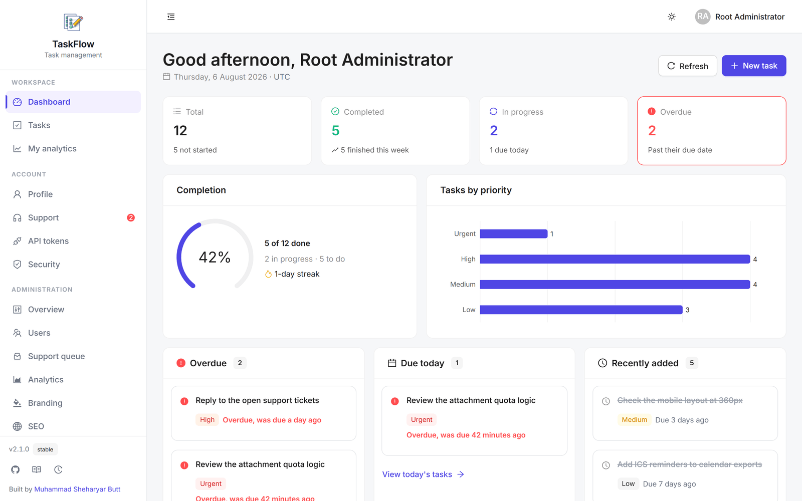

</div>

---

TaskFlow is a full-stack task manager you run yourself. It is deliberately small in surface area and complete in the parts that usually get skipped: real authentication with multi-factor support, per-user storage quotas, an audit trail, cookie consent that is actually recorded, and an admin console that lets the owner change branding, SEO and policy text without touching code or redeploying.

Everything lives in one PostgreSQL database (including uploaded files), so a backup is a single `pg_dump` and there is no object store to configure.

## Contents

- [Screenshots](#screenshots)
- [Features](#features)
- [Architecture](#architecture)
- [Quick start](#quick-start)
- [Configuration](#configuration)
- [The root account](#the-root-account)
- [Project layout](#project-layout)
- [Scripts](#scripts)
- [Testing](#testing)
- [Documentation](#documentation)
- [Contributing](#contributing)
- [License](#license)

## Screenshots

Every image below is the running application, captured at 1440x900 against a
seeded database. Nothing is a mockup.

### The task list

Search, filter by any combination of status, priority, tag or due date, then act
on a selection. Light and dark are a single theme driven by the colours set in
the control panel.

<table>
  <tr>
    <td width="50%">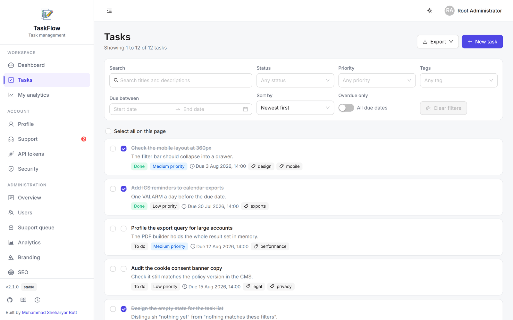</td>
    <td width="50%">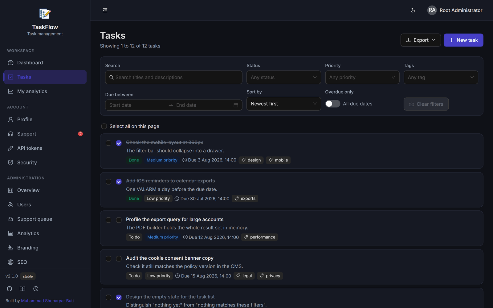</td>
  </tr>
</table>

### Reporting

Every user gets a private view of their own work. Root and admins additionally
get installation-wide figures with weekly retention cohorts and CSV export.

<table>
  <tr>
    <td width="50%">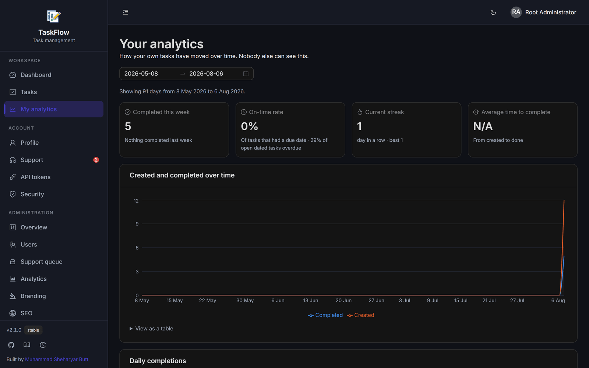</td>
    <td width="50%">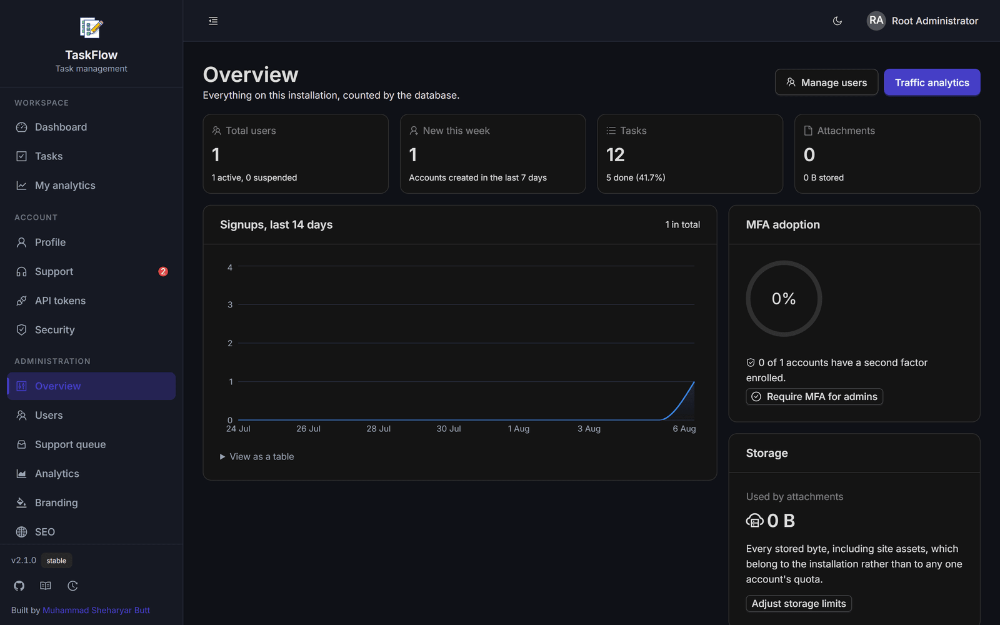</td>
  </tr>
</table>

### The control panel

Branding, SEO, legal copy, feature flags and quotas are all editable at runtime.
Changing the primary colour re-themes the entire application without a redeploy.

<table>
  <tr>
    <td width="50%">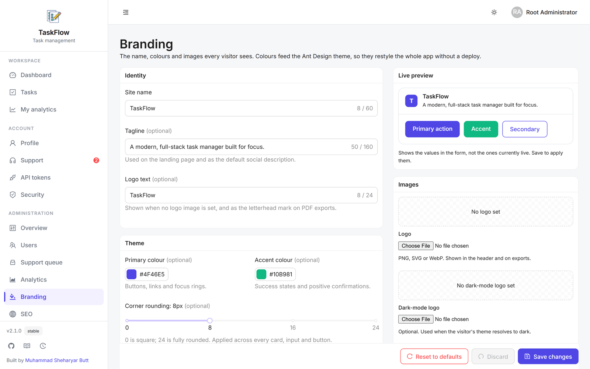</td>
    <td width="50%">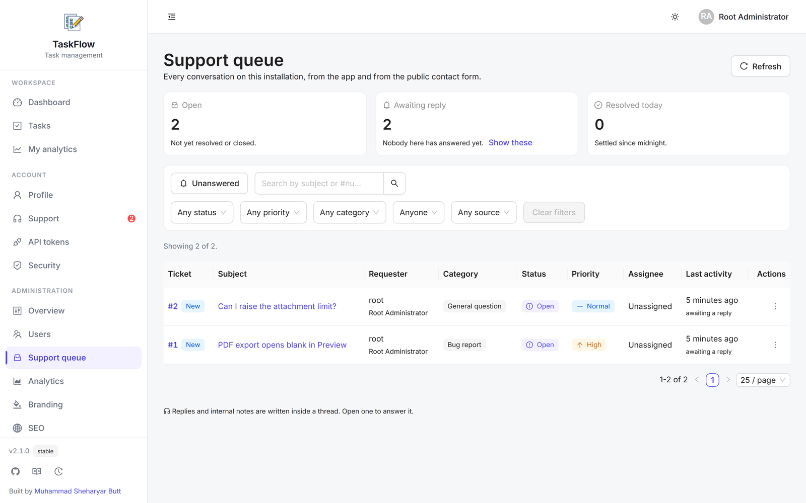</td>
  </tr>
</table>

### Public pages

<table>
  <tr>
    <td width="50%">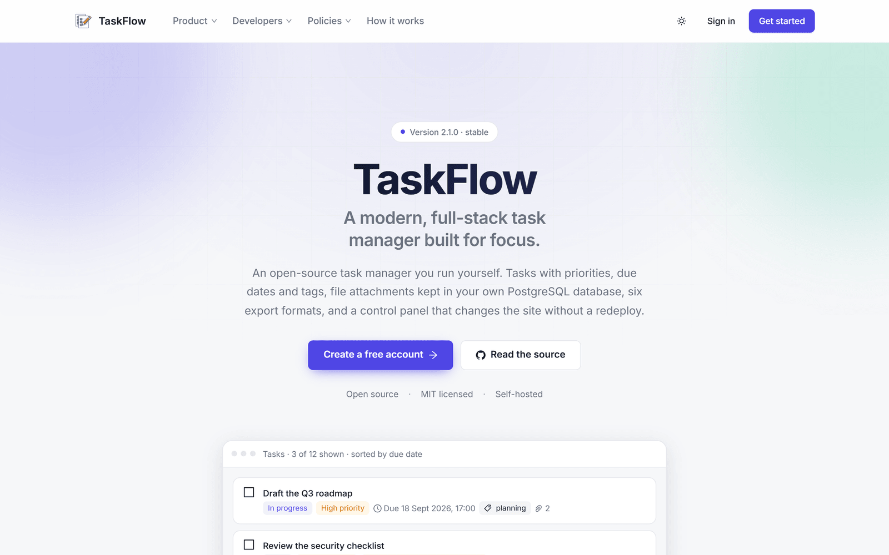</td>
    <td width="50%">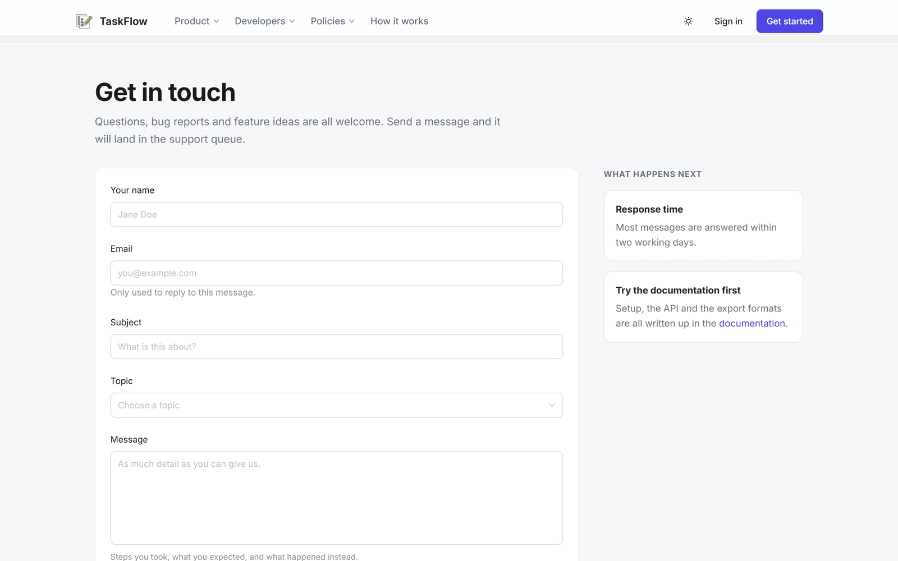</td>
  </tr>
</table>

### At 390px

The same screens on a phone. The sidebar becomes a drawer and the filter bar
collapses; nothing is hidden or cut off.

<p align="center">
  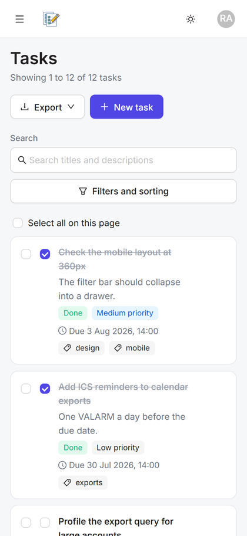
  &nbsp;&nbsp;
  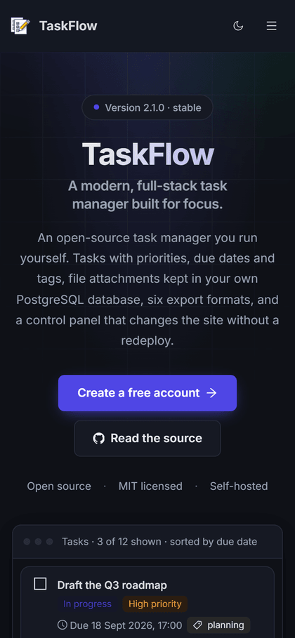
</p>

## Features

### Tasks

Titles, rich descriptions, four priority levels, three states, due dates, free-form tags and manual ordering. PostgreSQL full-text search across titles and descriptions, filtering by any combination of status, priority, tag, due-date range or overdue-ness, and bulk actions over a selection. Deletes are soft, so an accidental removal is one click away from being undone.

### Attachments stored in PostgreSQL

Files are written to a `bytea` column rather than an object store. That keeps the deployment to one moving part, which is why uploads are capped: 1 MB per file by default, with a 25 MB per-user allowance and a higher ceiling for administrators. All three limits are editable in the admin console.

Uploads are validated by inspecting the file's **magic bytes**, not the `Content-Type` header the client sends, so renaming `payload.html` to `photo.png` does not get past the allowlist. Anything that is not an image or PDF is served with `Content-Disposition: attachment`, and SVG always is.

### Exports

One filtered task list, six formats:

| Format | Notes |
| --- | --- |
| **PDF** | True A4, with your logo and organisation details as a letterhead, a summary band, a real table with repeating headers, and `Page N of M` footers |
| **XLSX** | Typed cells: real dates, not strings |
| **CSV** | UTF-8 BOM prefixed, so Excel opens accented characters correctly |
| **JSON** | The full records, for scripting |
| **Markdown** | Grouped by status with checkboxes |
| **ICS** | RFC 5545 calendar events with reminders, for tasks that have a due date |

Exports honour whatever filters are active, and the PDF states them in plain language so a printed report says what it excluded.

### A read-only API for your own site

Create a personal access token from **Account → API tokens** and fetch your task
list from anywhere, whether that is a personal site, a status page or a script:

```bash
curl -H "Authorization: Bearer tf_pat_..." https://your-taskflow/api/v1/tasks
```

Tokens are read-only, scoped (`tasks:read`, `stats:read`, `profile:read`), bound
to your own data, and expire on a schedule you choose. A leaked token exposes
your task titles, not your account.

The `/api/v1` surface serves wildcard CORS so browser code on your own domain can
call it directly. That is only safe because it *refuses cookie authentication
outright*: a bearer token is never attached automatically by a browser, so an
arbitrary site can reach the endpoint but cannot authenticate as a visitor who
happens to be signed in. Full reference at **/docs/api** inside the app.

### Analytics

Three separate views, all first-party:

- **Your productivity**: completion trends, on-time rate, streaks, a
  contribution-style heatmap, busiest day and hour, and your most-used tags.
- **Installation analytics** (root/admin): active users, weekly retention
  cohorts, storage growth, top paths and referrers, with CSV export.
- **Token usage**: per-token request counts, so you can see whether an
  integration is working, or being abused.

### Support desk and contact form

A single queue serves both, because they are the same thing from the operator's
side: a conversation that needs an answer.

- Signed-in users open tickets from **Account → Support**: threaded replies,
  status and priority, categories, file attachments, unread badges.
- Signed-out visitors use the public **contact form**, which creates a ticket in
  the same queue with a reference number they can quote.
- Root and admins get a staff queue with assignment, an *Unanswered* filter, and
  **internal notes** the requester never sees (enforced in the SQL, not by
  filtering after the fact).

The contact form is the one endpoint on the site an anonymous stranger can write
to, so it is defended in layers: a honeypot field that returns an ordinary
success response rather than announcing itself, a minimum fill time that a
script cannot satisfy, a per-IP hourly cap counted in the database *and* an
in-process rate limiter, length ceilings, and a feature flag to close it
entirely. Every threshold is editable by root without a redeploy.

### Authentication and accounts

- **Argon2id** password hashing at the OWASP-recommended parameters.
- A short-lived access token plus an opaque, rotating refresh token, both in `HttpOnly` cookies. Reuse of an already-rotated refresh token is treated as theft and revokes every session for that account.
- **TOTP multi-factor authentication** compatible with any authenticator app, with secrets encrypted at rest, ten single-use recovery codes, and replay protection that stops an intercepted code being used twice.
- Per-device session list with individual revoke and a "sign out everywhere" that takes effect immediately rather than when tokens expire.
- Account lockout after repeated failed attempts, and identical error messages for "wrong password" and "no such user" so the API cannot be used to enumerate accounts.

### Roles and the admin console

Three roles: `root`, `admin`, `user`. Root owns the installation; the application refuses to delete, demote or suspend the last one, so you cannot lock yourself out.

The console is a CMS for the whole site:

- **Branding**: site name, tagline, logo (light and dark), favicon, Open Graph image, primary and accent colours, corner radius. Colour and radius changes re-theme the entire UI.
- **SEO**: title template, default title and description, keywords, canonical URL, Twitter handle, organisation details, search-console verification tokens, and an indexing switch for staging deployments.
- **Legal**: Privacy, Terms and Cookie policy documents in Markdown, with a policy version that re-prompts every visitor for consent when you raise it.
- **Footer**: credit line, copyright template, and editable link and social lists.
- **Limits**: upload size, per-role storage quotas, attachments per task, and the accepted MIME allowlist.
- **Features**: registration on/off, mandatory MFA for administrators, and a maintenance mode that locks out everyone except root.
- **Users**: search, filter, change roles, suspend, set individual quotas, reset a password, and reset MFA for someone who has lost their authenticator.
- **Audit log**: an append-only record of every privileged action, with no write or delete path exposed anywhere in the application.

### Privacy

First-party analytics with no third-party scripts and no advertising cookies. Visitors are counted using a daily-rotating HMAC, which cannot be reversed or used to follow someone across days. Nothing is recorded until analytics consent is given, `DNT`/`Sec-GPC` are honoured, and consent is stored in the database as well as a cookie so it is demonstrable.

## Architecture

```text
                    ┌──────────────────────────────┐
   Browser  ───────▶│  Next.js 16  (Frontend/)     │
                    │  App Router · React 19       │
                    │  Ant Design 6 · SSR metadata │
                    └──────────────┬───────────────┘
                                   │  /api/* rewrite
                                   ▼
                    ┌──────────────────────────────┐
                    │  Express 5  (Server/)        │
                    │  Drizzle ORM · zod · Argon2  │
                    └──────────────┬───────────────┘
                                   ▼
                    ┌──────────────────────────────┐
                    │  PostgreSQL                  │
                    │  tasks · users · files       │
                    └──────────────────────────────┘
```

The browser never calls the API directly. `next.config.ts` rewrites `/api/*` to the Express origin, which keeps every request same-origin, and that is what allows the session cookies to stay `SameSite=Lax` instead of the weaker `SameSite=None`. See [docs/ARCHITECTURE.md](docs/ARCHITECTURE.md) for the full request lifecycle.

## Quick start

**Requirements:** Node.js 20.9+, PostgreSQL 13+, npm.

```bash
git clone https://github.com/shehari007/full-stack-todo-web-app.git
cd full-stack-todo-web-app
```

### 1. Database

If you do not already have PostgreSQL running:

```bash
docker run -d --name taskflow-db \
  -e POSTGRES_PASSWORD=postgres \
  -e POSTGRES_DB=taskflow \
  -p 5432:5432 postgres:17-alpine
```

### 2. API

```bash
cd Server
npm install
cp .env.example .env
npm run gen:secret        # prints the three secrets to paste into .env
```

Open `.env`, paste the generated secrets, and check `DATABASE_URL`. Then:

```bash
npm run db:migrate        # create the database (if missing) and the schema
npm run db:seed           # create the root account and default settings
npm run dev               # http://localhost:8000
```

`db:migrate` creates the database named in `DATABASE_URL` if it does not exist yet, so you only need a running PostgreSQL server, not a pre-made database. On managed providers that do not allow connecting to the `postgres` maintenance database (Supabase and similar), it skips that step, since there the database always exists already.

`db:seed` prints the root credentials once. **Copy them.** Add `-- --demo` to also create a sample account with example tasks.

### 3. Web app

In a second terminal:

```bash
cd Frontend
npm install
cp .env.example .env.local
npm run dev               # http://localhost:3000
```

Sign in at [http://localhost:3000/login](http://localhost:3000/login) with the root credentials from step 2.

### 4. Make it yours

Open **Control panel → Branding** and set the site name, logo and colours. Then **Security → Multi-factor authentication** and enrol an authenticator app before you expose this to anything.

## Configuration

Every setting is validated at boot by [`Server/src/config/env.ts`](Server/src/config/env.ts). If a value is missing or unsafe the server refuses to start and names the key, rather than failing later at request time.

The variables you must set are the three secrets and `DATABASE_URL`. Everything else has a working default for local development. Two are worth understanding before you deploy:

| Variable | Why it matters |
| --- | --- |
| `TRUST_PROXY` | How many reverse proxies sit in front of the API. This is a security setting: too high on a directly-exposed server lets any client spoof `X-Forwarded-For`, and that header is the rate-limiter key. `0` for bare Node, `1` behind Vercel/Render/Railway. |
| `COOKIE_SECURE` | Must be `true` in production, or session cookies travel in plaintext. The server will not boot with `NODE_ENV=production` and this unset. |

Operational limits (upload sizes, quotas, feature flags) live in the **database**, not the environment. The environment variables only seed them on first run, so raising a quota later needs no redeploy. Full tables are in [docs/DEPLOYMENT.md](docs/DEPLOYMENT.md).

## The root account

`npm run db:seed` creates a single `root` user from `ROOT_USERNAME` / `ROOT_EMAIL` / `ROOT_PASSWORD`. Leave `ROOT_PASSWORD` blank and it generates a strong one and prints it exactly once.

Re-running the seed will not create a second root or overwrite settings you have customised. If you lose the password:

```bash
npm run db:seed -- --force
```

That resets it and signs out every existing session for the account.

Root can do everything an admin can, plus create users, change roles, reset passwords and MFA, delete accounts, and edit every settings section. An `admin` is a delegated moderator and cannot act on a root or on another admin. That is enforced on the server, not just hidden in the UI.

## Project layout

```text
full-stack-todo-web-app/
├── Server/                     Express 5 API (TypeScript, native ESM)
│   ├── src/
│   │   ├── config/             env validation, CMS settings registry
│   │   ├── db/                 Drizzle schema, migrate + seed scripts
│   │   ├── lib/                crypto, tokens, TOTP, PDF, audit, logger
│   │   ├── middleware/         auth, CSRF, rate limits, validation, errors
│   │   ├── modules/            one folder per feature: routes + service + schemas
│   │   ├── app.ts              middleware assembly
│   │   └── index.ts            entry point
│   ├── drizzle/                generated SQL migrations (committed)
│   └── scripts/                smoke test
│
├── Frontend/                   Next.js 16 App Router (TypeScript)
│   └── src/
│       ├── app/                routes, metadata, sitemap, robots, manifest
│       ├── components/         feature components
│       ├── lib/                API clients (browser + server)
│       ├── providers/          theme and auth context
│       └── proxy.ts            route guard (Next 16 renamed middleware → proxy)
│
└── docs/                       architecture, API, security, deployment
```

Each API module follows the same three-file convention (`*.routes.ts` for HTTP, `*.service.ts` for logic, `*.schemas.ts` for zod validation), so the shape of an unfamiliar module is predictable.

## Scripts

**`Server/`**

| Command | What it does |
| --- | --- |
| `npm run dev` | Start with reload |
| `npm run build` / `npm start` | Compile to `dist/` and run it |
| `npm run typecheck` | Type-check without emitting |
| `npm run db:generate` | Generate a migration after changing the schema |
| `npm run db:migrate` | Apply pending migrations (forward-only) |
| `npm run db:seed` | Create root + default settings (idempotent) |
| `npm run db:studio` | Browse the database |
| `npm run gen:secret` | Generate correctly-sized secrets |
| `npm run test:smoke` | End-to-end test against a running server |
| `npm run test:security` | Security regression tests |
| `npm run test:tokens` | Personal access token and public API tests |
| `npm run test:support` | Support desk and contact form tests |

**`Frontend/`**

| Command | What it does |
| --- | --- |
| `npm run dev` | Development server |
| `npm run build` / `npm start` | Production build and serve |
| `npm run typecheck` | Type-check |

## Testing

The API ships with three test suites that run against a real server and a real
database, because the things worth testing here (authorisation, isolation,
revocation) are invisible to a unit test.

```bash
cd Server
npm run dev                                    # in one terminal

export SMOKE_PASSWORD='<your root password>'
npm run test:smoke      # CRUD, uploads, exports, isolation, sessions
npm run test:tokens     # token lifecycle and the public API boundary
npm run test:support    # ticket isolation, internal notes, contact-form abuse limits
npm run test:security   # the defects found in review, each one fixed
```

Run `test:security` last in a single session. It deliberately trips the sign-in
rate limiter, which will make any auth request after it fail.

They create test data under the account they sign in with, so point them at a
development database. All three run in CI against a Postgres service container.

## Documentation

| Document | Contents |
| --- | --- |
| [docs/ARCHITECTURE.md](docs/ARCHITECTURE.md) | System shape, request lifecycle, data model, trade-offs |
| [docs/API.md](docs/API.md) | Every endpoint, with request and response examples |
| [docs/SECURITY.md](docs/SECURITY.md) | Threat model, controls, hardening checklist, disclosure |
| [docs/DEPLOYMENT.md](docs/DEPLOYMENT.md) | Docker, Vercel, Supabase, environment reference |
| [docs/CONTRIBUTING.md](docs/CONTRIBUTING.md) | Conventions and how to get a PR merged |

## Upgrading from v1

v2 is a rewrite and the data model changed substantially: tasks gained real timestamp due dates in place of `DD-MM-YYYY` strings, users gained roles and MFA, and passwords moved from bcrypt to Argon2id. There is no in-place migration path. Start from a fresh database, and export anything you need from the old one first.

The environment variables changed too: `SEQ_CONNECTION` is still accepted as a fallback for `DATABASE_URL`, but `JWT_KEY` has been replaced by separate access and refresh secrets.

## Contributing

Issues and pull requests are welcome. Please read [docs/CONTRIBUTING.md](docs/CONTRIBUTING.md) first. It covers the conventions that are easy to get wrong, particularly the ESM import extensions and the migration workflow.

Found a security issue? Please **do not** open a public issue. See [docs/SECURITY.md](docs/SECURITY.md).

## License

MIT. See [LICENSE](LICENSE).

<div align="center">
<br/>

Built by [Muhammad Sheharyar Butt](https://github.com/shehari007)

<a href="https://www.buymeacoffee.com/shehari007">
  
</a>

</div>
